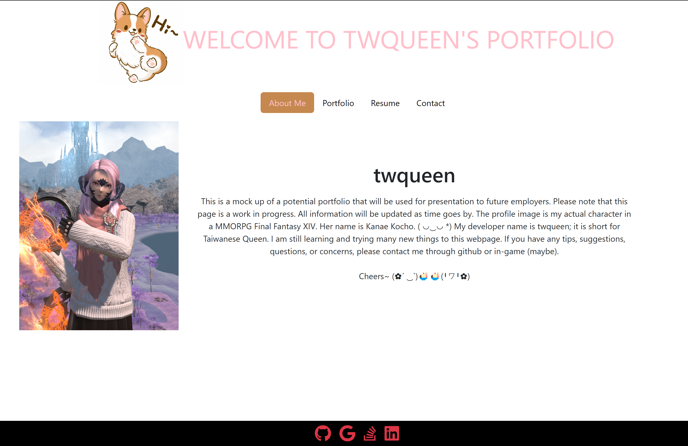

# MyPortfolioII

## Table of Contents
  * [Description](#description)
  * [Installation](#installation)
  * [Usage](#usage)
  * [Licenses](#license)
  * [Contributing](#contributing)
  * [Credits](#credits)
    
## Description
This is a second attempt at making a portfolio to present my web-development skills. Previous version from 5 months ago was made with purely CSS and HTML. This time the main character is React.js! Styling is mainly supported through bootstrap. There are many other npm packages that helped along the way.

## Installation
If you decided to fork/clone this repo, please do an `npm i` to install all dependencies. Otherwise, enjoy the site on Github Pages. Link Below.

## Usage
Live Site: https://twqueen.github.io/MyPortfolioII/

Sample Page Screenshot

## License
MIT License

## Contributing
Feel free to clone or fork the repo and create any changes you wish to make the application better!

## Credits
* https://medium.com/@vitaliysteffensen/react-js-how-to-add-an-image-a-beginners-guide-66334f1d18be
* https://www.positronx.io/how-to-build-a-simple-contact-form-in-react-js-app/
* https://react-hook-form.com/form-builder
* https://www.digitalocean.com/community/tutorials/creating-a-social-follow-component-in-react
* https://www.emoticonstext.com/cute.html

